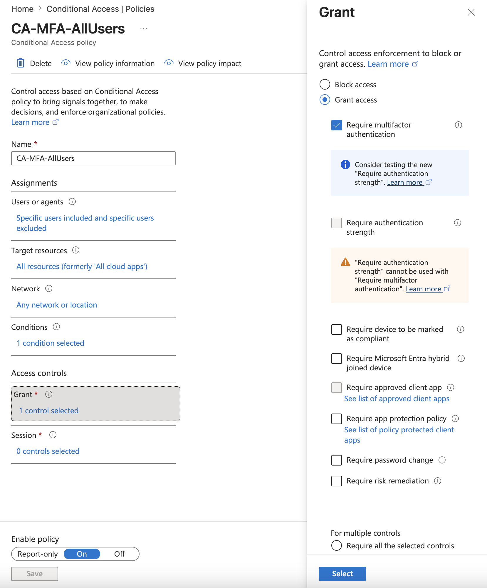
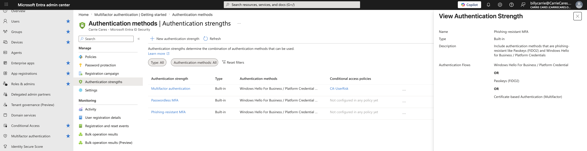
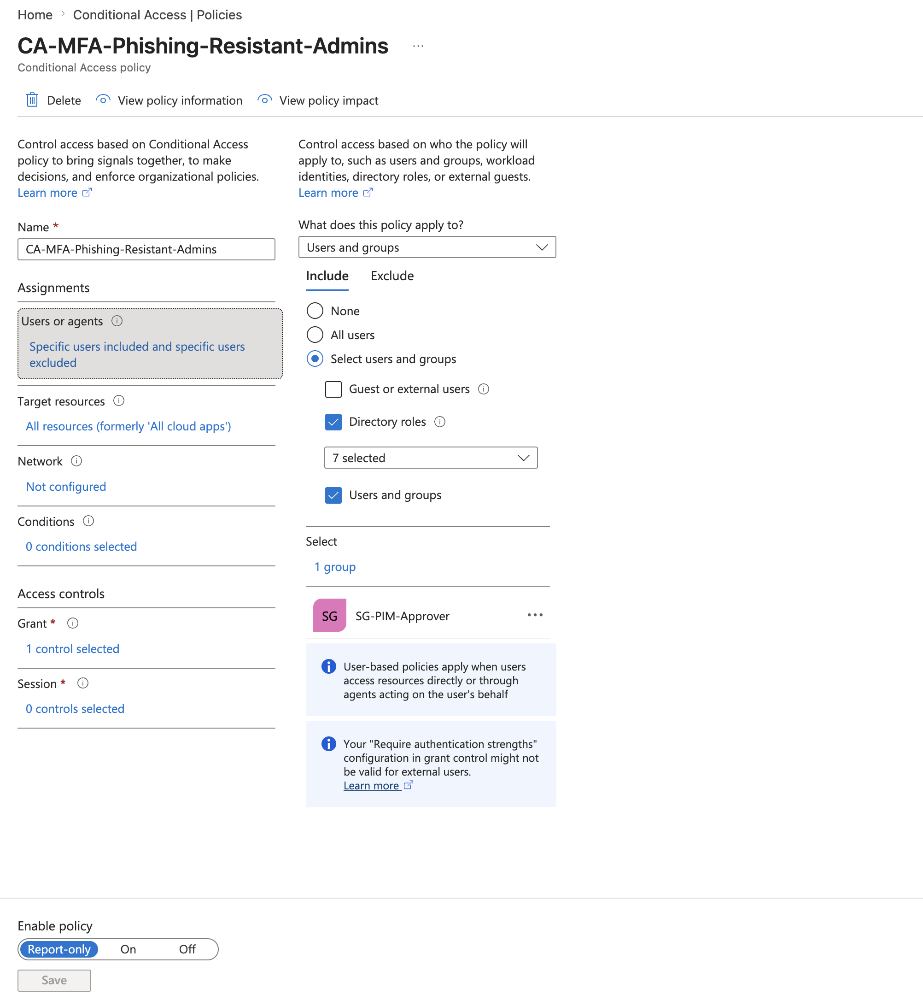

# Big Win #1: Stop the "Data-Mining" Entry Point
## Enforce Phishing-Resistant Multi-Factor Authentication (MFA)

### Why This Matters
When you add AI tools to your business, those tools can search through files and emails at lightning speed. If a hacker compromises an employee’s account via a phishing attack, they don't just get into that inbox, they can now use your own AI technology to instantly mine and summarize your entire company’s history, financial files, and client data.

Standard text-message (SMS) codes and basic phone prompts are no longer enough. We need to lock the front door with a key that hackers cannot duplicate.

---

### The Goal
1. **Secure Everyone:** Enforce standard MFA for all users.
2. **Strengthen Administrative Access:** Force high-privileged administrative accounts (Global Admin, Billing Admin, Application Admin) to use Phishing-Resistant MFA (like Windows Hello for Business, Face ID/Fingerprints via Microsoft Authenticator, or physical FIDO2 security keys).

---

### Step-by-Step Configuration Guide

#### Step 1: Enforce MFA for All Users
1. On the left menu, go to **Protection** > **Conditional Access**.
2. Click **Create new policy**.
3. Give it a clear name: `CA-MFA-AllUsers`.
4. Under **Assignments**, choose **Users**. Select *All Users* (or start with a small pilot group of management/admin staff first to test).
5.    Best Practice: Exclude any Break Glass Accounts/ Emergency accounts to prevent lock out or access issues during incident response.
6. Under **Target resources**, select **All cloud apps**.
7. Under **Locations** (located under *Conditions*):
   * Toggle **Yes** for *Configure*.
   * Choose **Any network or location**.
8. Under **Grant** (located under *Access Controls*):
   * Select **Grant Access** 
   * Check **Require multifactor authentication**
9. Set the **Enable policy** toggle at the bottom to **Report-only** (Recommended to test without locking anyone out) or **On** if you are ready to turn on now.
10. Click **Create**.

---

#### Step 2: Enforce Phishing Resistant MFA for Admins
1. Log into the **[Microsoft Entra Admin Center](https://entra.microsoft.com/)**.
2. On the left menu, expand **Entra ID** and click **Authentication methods**.
3. Under this section, look at **Authentication strengths** on the left menu. You will see a built-in option called **Phishing-resistant MFA**. This is what we will target for our admins.

4. On the left menu, go to **Protection** > **Conditional Access**.
5. Click **Create new policy**.
6. Give it a clear name: `CA-MFA-Phishing-Resistant-Admins`.
7. Under **Assignments**, Include **Select users and groups** and Select *Directory Roles* and *Users and groups*.
   *Recommended Directory Roles:
      - Global Admin
      - AI Admin
      - Billing Admin
      - Application Admin
      - Conditional Access Admin
      - Privileged Role Admin
      - Privileged Authentication Admin
   * Recommended Users and groups:
      - Security Group (PIM Approval)
      - Security Group Admins/ Members in IT & Security
         - Named accounts preferred over service accounts/ generic accounts with no clear owner.
8.    Best Practice: Exclude any Break Glass Accounts/ Emergency accounts to prevent lock out or access issues during incident response.
9. Under **Target resources**, select **All cloud apps**.
10. Under **Grant** (located under *Access controls*):
   * Select **Grant access**.
   * Check the box for **Require authentication strength**.
   * Choose **Phishing-resistant MFA** from the dropdown.
11. Set the **Enable policy** toggle at the bottom to **Report-only** (Recommended to test without locking anyone out) or **On** if you are ready to turn on now.
12. Click **Create**.

#### Framework Alignment/ Business Impact:
OWASP LLM Top 10 Alignment: LLM06 (Sensitive Data Disclosure)

The Standard: This category focuses on the unauthorized preview or extraction of proprietary information. Because internal AI deployments can instantly crawl and surface a company's data footprint, protecting administrative identities with hardware-backed MFA prevents an outside attacker from using your own LLM environment against you.

---

## **Author**

**Billy Carrie** — Founding Security Engineer

